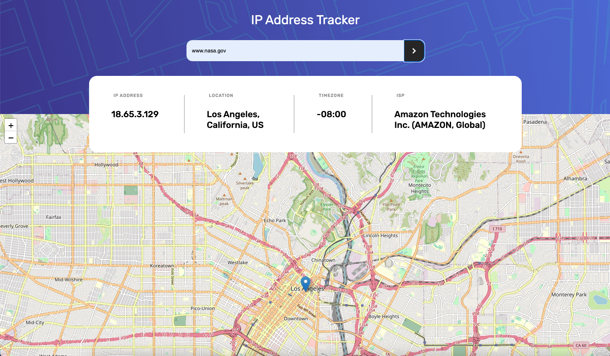

# Frontend Mentor - IP address tracker solution

This is a solution to the [IP address tracker challenge on Frontend Mentor](https://www.frontendmentor.io/challenges/ip-address-tracker-I8-0yYAH0). Frontend Mentor challenges help you improve your coding skills by building realistic projects. 

## Table of contents

- [Overview](#overview)
  - [The challenge](#the-challenge)
  - [Screenshot](#screenshot)
  - [Links](#links)
- [My process](#my-process)
  - [Built with](#built-with)
  - [What I learned](#what-i-learned)
  - [Continued development](#continued-development)
  - [Useful resources](#useful-resources)
- [Author](#author)
- [Acknowledgments](#acknowledgments)


## Overview

What a great challenge! When I first stepped up to do my first intermediate project from Frontend Mentor I didn't quite know what I was getting myself into, nor did I know how much I would learn by taking on this challenge. I learnt React and built my first app with an express server. Thank you for the great challenges Frontend Mentor.

### The challenge

Users should be able to:

- View the optimal layout for each page depending on their device's screen size
- See hover states for all interactive elements on the page
- See their own IP address on the map on the initial page load
- Search for any IP addresses or domains and see the key information and location

### Screenshot




### Links

- Solution URL: [https://github.com/timbosTours/Frontend-Mentor-ip-address](https://github.com/timbosTours/Frontend-Mentor-ip-address)
- Live Site URL: [https://glittery-halva-a7c1b2.netlify.app/search](https://glittery-halva-a7c1b2.netlify.app/search)

## My process

I went with a mobile first approach. Starting off with the html and a basic GET request to fetch data from Ipify. I quickly hit the wall of needing to hide my API keys which led me to adding an Express server. Learning both React and Express meant that this project took a while but it taught me a lot. I kept learning and tinkering and learning and tinkering. I sorted out all the CSS pretty early on in the process but had to learn a lot more about working with API's and React hooks like useEffect. I finished off with adding the ability to search domains where as at the start I only had it requesting IP address's.

### Built with

- Semantic HTML5 markup
- Mobile-first workflow
- [React](https://reactjs.org/) - JS library
- [React-Leaflet](https://react-leaflet.js.org/)
- [Ipify](https://www.ipify.org/)
- [Express](https://expressjs.com/)
- [Node](https://nodejs.org/en/)
- custom hooks
- [Formik](https://formik.org/)
- [Axios](https://axios-http.com/docs/intro)


### What I learned

I learned that when working with API's you often need to hide your private keys, this means either adding a server or using serverless functions. This was my first POST request which incuded my first Regex.

```js
app.post('/search', async (req, res) => {
  const value = await req.body.values.inputValue

    let search_fetch_response = {}

    
  if (DOMAIN_REGEX) {
    try{  
      search_fetch_response = await
        axios.get(`${url}apiKey=${apiKey}&domain=${value}`);
    } catch (error) {
      return res.status(500).send({ error: error.message });
    }
  } 

  let searchIpData = await search_fetch_response.data;
  res.json(searchIpData)
  console.log(searchIpData)
})
```

And my first time using a custom hook

```js
import { useEffect, useState } from 'react';
import axios from "axios";

// custom hook to get users data on load
function useFetch(url) {

    const [data, setData] = useState(null);
    const [loading, setLoading] = useState(false);
    const [error, setError] = useState(null);


    useEffect(() => {
        setLoading(true);
        axios
            .get(url)
            .then(res => { setData(res.data) })
            .catch((err) => { setError(err) })
            .finally(() => { setLoading(false) })
    }, [url]);

    return { data, loading, error};
}

export default useFetch
```

### Continued development

A11y could be better, leaflet does not have great accessibility built in. The loading spinners can be improved and the leaflet load time is not optimal.

### Useful resources

- [PedroTech](https://www.youtube.com/@PedroTechnologies) - This guys channel helped me with React hooks and Formik
- [Prof3ssorSt3v3](https://www.youtube.com/@SteveGriffith-Prof3ssorSt3v3) - Got me through building my express server.


## Author

- Website - [@timbosTours](https://github.com/timbosTours)
- Frontend Mentor - [@timbosTours](https://www.frontendmentor.io/profile/timbosTours)
- Twitter - [@timbosTours](https://www.twitter.com/@timbosTours)


## Acknowledgments

Thank you to Frontend Mentor for this awesome challenge, and thank you to anyone who reviews my code and to all the amazing web dev content creators out there!
